# LCDeeD
An LCD TV simulation renderer for Processing


## Overview

LCDeeD is a **retro-style LCD/TV display simulator** that recreates the look and behavior of vintage computer monitors and television screens. The system creates a pixel-perfect grid of individual display elements that can be controlled and animated to produce authentic retro visual effects.

### New LCDDInput Source Model

The system now features a **pluggable LCDDInput architecture** that allows for custom drawing effects to be rendered directly to each LCD screen. This modular design replaces the previous hardcoded content system with a flexible, extensible framework:

**Abstract Base Class**: `LCDDInput` provides the foundation with common properties (position, colors, alpha, animation timing) and abstract `render()` method that subclasses must implement.

**Built-in LCDDInput Types**:
- **PulseLCDDInput**: Animated concentric circles that pulse outward from the center
- **GridLCDDInput**: Animated grid pattern with moving offset
- **ImageLCDDInput**: Static image display with transparency support  
- **FireFliesLCDDInput**: Complex procedural animation with fireflies and swaying grass

**Integration**: Each LCDD screen can have its own LCDDInput instance that renders during the update cycle. The rendered content is automatically scaled and applied to the pixel grid, maintaining the retro aesthetic while allowing for rich, custom visual content.

**⚠️ Critical Setup Note - pixelDensity(1)**

**IMPORTANT**: LCDeeD requires `pixelDensity(1)` to be set in `setup()` for pixel-accurate rendering. Without this setting, the LCD pixel grid will not align properly with the display, causing visual artifacts and incorrect scaling. This was a significant debugging issue that cost considerable development time - always ensure `pixelDensity(1)` is called before any display initialization.

### Core Components

**LCDD Class**: The main display simulator that converts screen dimensions into a lower resolution grid based on pixel size, creating that chunky, pixelated aesthetic of retro displays. Now supports pluggable LCDDInput sources for dynamic content generation.

**Pixel Management**: Each display pixel is individually addressable with RGB color control and luminosity settings. The system manages thousands of discrete pixel objects for precise control.

**LCDDInput System**: Modular content generation system where each screen can have its own custom drawing effect. LCDDInputs render to a PGraphics buffer that gets automatically converted to the pixel grid format.

**Visual Effects**:
- **Scanline Animation**: Implements a moving scanline effect that sweeps across the display, creating that classic CRT TV "rolling" effect
- **Overscan**: Adds vertical lines across the display to simulate CRT overscan artifacts  
- **Interlaced Rendering**: Alternates luminosity between even/odd lines for authentic retro look
- **Phosphor Simulation**: Individual sub-pixels (R,G,B) rendered separately to mimic CRT phosphor behavior

**Content Rendering Modes**:

The new LCDDInput architecture replaces the previous content mode system. Each LCDD screen now directly renders its assigned LCDDInput during the update cycle:

- **LCDDInput Enabled**: The assigned LCDDInput renders to the screen's backBuffer, which is then converted to the pixel grid
- **LCDDInput Disabled**: Screen displays static content or remains blank based on background settings
- **Multiple Screens**: Each of the four LCDD screens can run different LCDDInputs simultaneously

### Performance Optimizations

- **LCDDInput Caching**: Each LCDDInput manages its own animation state and only renders when enabled
- **Dirty Rectangle Tracking**: Only redraws changed regions instead of full screen updates  
- **Scanner State Caching**: Optimized scanline effects with minimal per-frame processing
- **Bounds Checking**: Safe array access when switching between display modes
- **Per-Screen Isolation**: Each LCDD manages its own LCDDInput independently for maximum performance

## Rendering Pipeline

```
┌─────────────────────────────────────────────────────────────────┐
│                          DRAW() FUNCTION                        │
└─────────────────────────────────────────────────────────────────┘
                                    │
                                    ▼
┌─────────────────────────────────────────────────────────────────┐
│                    FOR EACH LCDD SCREEN                         │
│                        lcdd.update()                            │
└─────────────────────────────────────────────────────────────────┘
                                    │
                                    ▼
┌─────────────────────────────────────────────────────────────────┐
│                  LCDDInput ENABLED CHECK                        │
│              if (sourceInput.isEnabled())                       │
└─────────────────┬───────────────────┬───────────────────────────┘
        YES       │                   │ NO - Skip to display()
                  ▼                   ▼
┌─────────────────────────────────┐ ┌─────────────────────────────┐
│        LCDDInput RENDERING      │ │      STATIC DISPLAY         │
│   ┌──────────────────────────┐  │ │                             │
│   │ sourceInput.update()     │  │ │   Use existing pixel state  │
│   │ backBuffer.beginDraw()   │  │ │   Apply scanline effects    │
│   │ sourceInput.render()     │  │ │   Render with current       │
│   │ backBuffer.endDraw()     │  │ │   overscan settings         │
│   │ Convert to pixel grid    │  │ │                             │
│   └──────────────────────────┘  │ │                             │
└─────────────────────────────────┘ └─────────────────────────────┘
                  │                   │
                  └─────────┬─────────┘
                            ▼
┌─────────────────────────────────────────────────────────────────┐
│                    LCDD.DISPLAY()                               │
│  • Apply scaling/translation transforms                         │
│  • Run scanline animation                                       │
│  • Render dirty pixel regions                                   │
│  • Apply overscan effects                                       │
│  • Show picture-in-picture if enabled                           │
└─────────────────────────────────────────────────────────────────┘
                            │
                            ▼
┌─────────────────────────────────────────────────────────────────┐
│                     FINAL SCREEN OUTPUT                         │
│    Either individual LCD screens OR full backBuffer             │
│              if all TVs are turned off (no LCDD effects)        │
└─────────────────────────────────────────────────────────────────┘
```

## Visual Events & Key Commands

The system uses a custom event system (`VisEvents.pde`) that maps keyboard inputs to visual effects and display controls but can also be fired programmatically as show in the "autoRun" mode:

### Display Controls
- **Tab**: Toggle split screen mode
- **1,2,3,4**: Select TV input (0-3)
- **!,@,#,$**: Toggle TV on/off
- **t**: Toggle picture-in-picture (PIP)

### LCDDInput Controls (NEW)
- **f**: Toggle custom LCDDInputs on/off for all screens
- **V**: Cycle through LCDDInput types (Pulse → Grid → Image → Pulse)
- **r**: Reset custom LCDDInputs (restart animations, reload state)

### Display Settings
- **M**: Toggle overscan effect
- **/,?**: Change/reset overscan color
- **<,>**: Adjust overscan width/interval  
- **.,comma**: Reset overscan parameters
- **-,=**: Scale down/up display
- **+**: Reset scale
- **_**: Reset translation
- **Z**: Toggle center scaling
- **L**: Toggle station logos

### Color & Effects
- **b**: Toggle background erasure
- **:**: Toggle pixel mode (changes sub-pixel rendering)
- **7,8,9**: Set brightness modes (0: interlaced, 1: full, 2: brightness-based)

### Special Functions
- **%**: Toggle auto mode (automatic effect cycling)
- **0**: Reset all settings (scale, translation, etc.)
- **D**: Toggle debug display (shows framerate)
- **Enter**: Save frame to screenshots/

### Arrow Keys
- **Left/Right**: Translate display horizontally
- **Up/Down**: Translate display vertically

### Auto Mode
When auto mode is enabled with **%**, the system automatically cycles through various visual effects and display settings using timer-driven events, creating dynamic, evolving displays without manual intervention.

## LCDDInput Architecture

The LCDDInput system represents a major architectural shift from hardcoded effects to a pluggable, extensible content generation framework. This design pattern enables easy creation of custom visual effects while maintaining the retro LCD aesthetic.

### Architecture Overview

```
┌─────────────────────────────────────────────────────────────────┐
│                        LCDD Screen                              │
│                                                                 │
│  ┌───────────────────────────────────────────────────────────┐  │
│  │                   LCDDInput                               │  │
│  │  • Abstract base class                                   │  │
│  │  • Common properties (position, colors, timing)         │  │
│  │  • abstract render(PGraphics buffer)                    │  │
│  └───────────────────────────────────────────────────────────┘  │
│                              │                                  │
│                              ▼                                  │
│  ┌───────────────────────────────────────────────────────────┐  │
│  │                 backBuffer                                │  │
│  │  • PGraphics canvas                                      │  │
│  │  • Rendered by LCDDInput.render()                       │  │
│  │  • Scaled to match LCDD resolution                      │  │
│  └───────────────────────────────────────────────────────────┘  │
│                              │                                  │
│                              ▼                                  │
│  ┌───────────────────────────────────────────────────────────┐  │
│  │              Pixel Grid Conversion                        │  │
│  │  • sourceImage(backBuffer.get(), 0)                     │  │
│  │  • Individual pixel RGB mapping                          │  │
│  │  • Luminosity and brightness processing                  │  │
│  └───────────────────────────────────────────────────────────┘  │
└─────────────────────────────────────────────────────────────────┘
```

### Creating Custom LCDDInputs

To create a custom LCDDInput, extend the abstract base class and implement the `render()` method:

```processing
class CustomLCDDInput extends LCDDInput {
  private float animationParam;
  
  public CustomLCDDInput(float x, float y, float w, float h) {
    super(x, y, w, h);
  }
  
  protected void initialize() {
    // Set up initial state
    animationParam = 0;
  }
  
  protected void updateAnimation() {
    // Update animation state each frame
    animationParam += speed;
  }
  
  public void render(PGraphics buffer) {
    if (!enabled) return;
    
    buffer.push();
    // Your custom drawing code here
    // Use this.time for animation timing
    // Use this.primaryColor and secondaryColor for theming
    // Use this.alpha for transparency
    buffer.pop();
  }
}
```

### Built-in LCDDInput Types

**PulseLCDDInput**: Creates animated concentric circles that pulse outward from the center, perfect for abstract visual effects or attention-grabbing displays.

**GridLCDDInput**: Renders an animated grid pattern with configurable spacing and moving offset, ideal for technical or geometric backgrounds.

**ImageLCDDInput**: Displays static images with proper scaling and transparency support, allowing for logos, patterns, or artistic content.

**FireFliesLCDDInput**: A complex procedural animation featuring fireflies with flocking behavior and animated grass, demonstrating the full power of the LCDDInput system for rich, interactive content.

## Screenshot Gallery

Click any image to view full size:

<a href="screenshots/LCDD00001.png"></a>
<a href="screenshots/LCDD00002.png"></a>
<a href="screenshots/LCDD00003.png"></a>
<a href="screenshots/LCDD00017.png"></a>
<a href="screenshots/LCDD00075.png"></a>
<a href="screenshots/LCDD00131.png"></a>
<a href="screenshots/LCDD00147.png"></a>
<a href="screenshots/LCDD00164.png"></a>
<a href="screenshots/LCDD00204.png"></a>
<a href="screenshots/LCDD00207.png"></a>
<a href="screenshots/LCDD00212.png"></a>
<a href="screenshots/LCDD00229.png"></a>
<a href="screenshots/LCDD00333.png"></a>
<a href="screenshots/LCDD00334.png"></a>
<a href="screenshots/LCDD00335.png"></a>
<a href="screenshots/LCDD00336.png"></a>
<a href="screenshots/LCDD00339.png"></a>
<a href="screenshots/LCDD00364.png"></a>
<a href="screenshots/LCDD00418.png"></a>
<a href="screenshots/LCDD00470.png"></a>
<a href="screenshots/LCDD00481.png"></a>
<a href="screenshots/LCDD00489.png"></a>
<a href="screenshots/LCDD00497.png"></a>
<a href="screenshots/LCDD00522.png"></a>
<a href="screenshots/LCDD00554.png"></a>
<a href="screenshots/LCDD00629.png"></a>
<a href="screenshots/LCDD00635.png"></a>
<a href="screenshots/LCDD00641.png"></a>
<a href="screenshots/LCDD00653.png"></a>
<a href="screenshots/LCDD00678.png"></a>
<a href="screenshots/LCDD00680.png"></a>
<a href="screenshots/LCDD00693.png"></a>
<a href="screenshots/LCDD00757.png"></a>
<a href="screenshots/LCDD00760.png"></a>
<a href="screenshots/LCDD00801.png"></a>
<a href="screenshots/LCDD00834.png"></a>
<a href="screenshots/LCDD00836.png"></a>
<a href="screenshots/LCDD00850.png"></a>
<a href="screenshots/LCDD00864.png"></a>
<a href="screenshots/LCDD00882.png"></a>
<a href="screenshots/LCDD00957.png"></a>
<a href="screenshots/LCDD00962.png"></a>
<a href="screenshots/LCDD00995.png"></a>
<a href="screenshots/LCDD01029.png"></a>
<a href="screenshots/LCDD01110.png"></a>
<a href="screenshots/LCDD01131.png"></a>
<a href="screenshots/LCDD01137.png"></a>
<a href="screenshots/LCDD01163.png"></a>
<a href="screenshots/LCDD01172.png"></a>
<a href="screenshots/LCDD01183.png"></a>
<a href="screenshots/LCDD01186.png"></a>
<a href="screenshots/LCDD01217.png">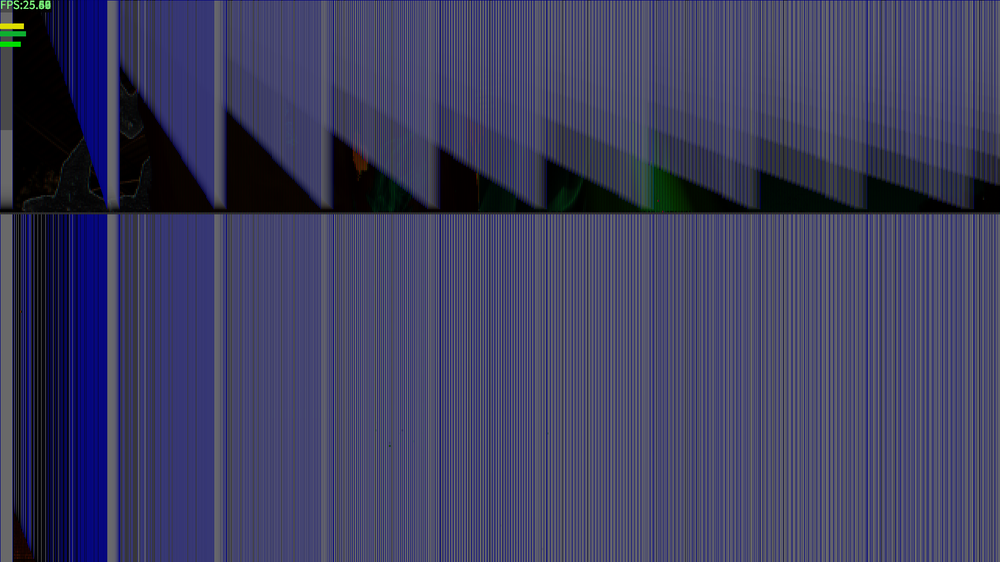</a>
<a href="screenshots/LCDD01244.png"></a>
<a href="screenshots/LCDD01284.png"></a>
<a href="screenshots/LCDD01321.png"></a>
<a href="screenshots/LCDD01390.png"></a>
<a href="screenshots/LCDD01399.png"></a>
<a href="screenshots/LCDD01404.png">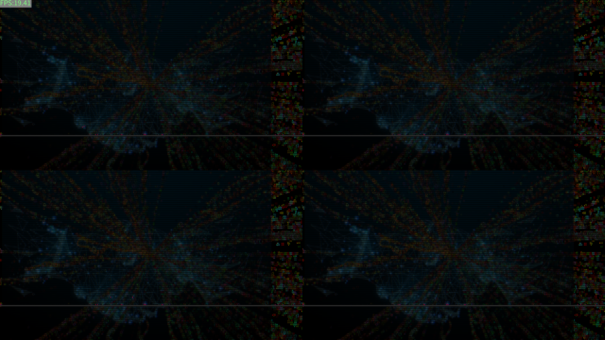</a>
<a href="screenshots/LCDD01415.png"></a>
<a href="screenshots/LCDD01435.png"></a>
<a href="screenshots/LCDD01446.png"></a>
<a href="screenshots/LCDD01501.png"></a>
<a href="screenshots/LCDD01510.png"></a>
<a href="screenshots/LCDD01511.png"></a>
<a href="screenshots/LCDD01535.png"></a>
<a href="screenshots/LCDD01542.png"></a>
<a href="screenshots/LCDD01547.png"></a>
<a href="screenshots/LCDD01585.png"></a>
<a href="screenshots/LCDD01616.png"></a>
<a href="screenshots/LCDD01689.png"></a>
<a href="screenshots/LCDD01713.png"></a>
<a href="screenshots/LCDD01751.png"></a>
<a href="screenshots/LCDD01863.png"></a>
<a href="screenshots/LCDD01893.png"></a>
<a href="screenshots/LCDD01907.png"></a>
<a href="screenshots/LCDD01925.png"></a>
<a href="screenshots/LCDD01995.png"></a>
<a href="screenshots/LCDD02024.png"></a>
<a href="screenshots/LCDD02053.png"></a>
<a href="screenshots/LCDD02062.png"></a>
<a href="screenshots/LCDD02098.png"></a>
<a href="screenshots/LCDD02208.png"></a>
<a href="screenshots/LCDD02212.png"></a>
<a href="screenshots/LCDD02230.png"></a>
<a href="screenshots/LCDD02331.png"></a>
<a href="screenshots/LCDD02358.png"></a>
<a href="screenshots/LCDD02364.png"></a>
<a href="screenshots/LCDD02390.png"></a>
<a href="screenshots/LCDD02395.png"></a>
<a href="screenshots/LCDD02403.png"></a>
<a href="screenshots/LCDD02439.png"></a>
<a href="screenshots/LCDD02552.png"></a>
<a href="screenshots/LCDD02561.png"></a>
<a href="screenshots/LCDD02619.png"></a>
<a href="screenshots/LCDD02627.png"></a>
<a href="screenshots/LCDD02637.png"></a>
<a href="screenshots/LCDD02640.png"></a>
<a href="screenshots/LCDD02690.png"></a>
<a href="screenshots/LCDD02716.png"></a>
<a href="screenshots/LCDD02759.png">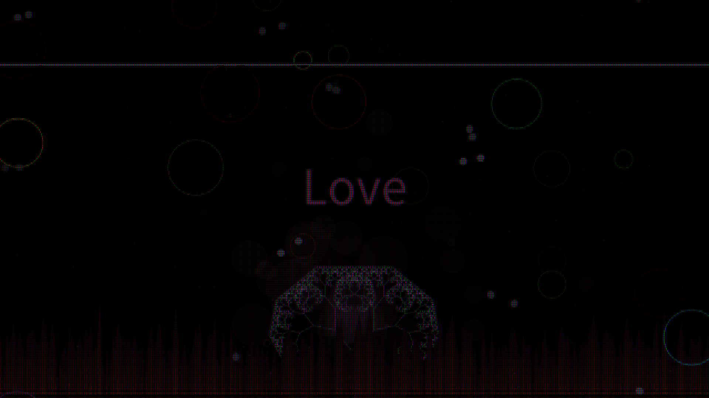</a>
<a href="screenshots/LCDD02802.png"></a>
<a href="screenshots/LCDD02927.png"></a>
<a href="screenshots/LCDD02930.png"></a>
<a href="screenshots/LCDD02989.png"></a>
<a href="screenshots/LCDD03000.png">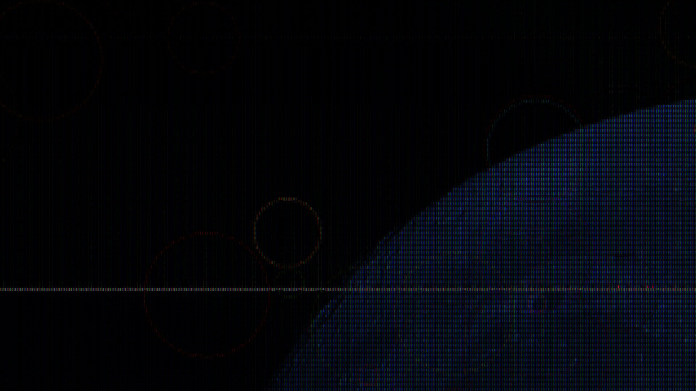</a>
<a href="screenshots/LCDD03031.png"></a>
<a href="screenshots/LCDD03179.png"></a>
<a href="screenshots/LCDD03184.png">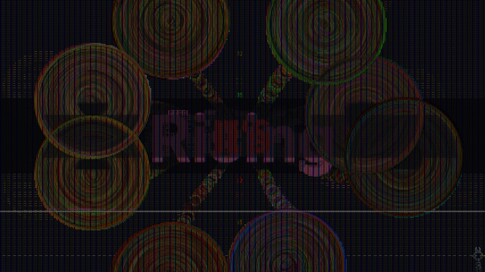</a>
<a href="screenshots/LCDD03198.png"></a>
<a href="screenshots/LCDD03206.png"></a>
<a href="screenshots/LCDD03223.png"></a>
<a href="screenshots/LCDD03226.png"></a>
<a href="screenshots/LCDD03245.png"></a>
<a href="screenshots/LCDD03250.png"></a>
<a href="screenshots/LCDD03260.png"></a>
<a href="screenshots/LCDD03283.png"></a>
<a href="screenshots/LCDD03323.png"></a>
<a href="screenshots/LCDD03468.png"></a>
<a href="screenshots/LCDD03496.png"></a>
<a href="screenshots/LCDD03582.png"></a>
<a href="screenshots/LCDD03621.png"></a>
<a href="screenshots/LCDD03649.png"></a>
<a href="screenshots/LCDD03686.png"></a>
<a href="screenshots/LCDD03688.png"></a>
<a href="screenshots/LCDD03720.png"></a>
<a href="screenshots/LCDD03747.png"></a>
<a href="screenshots/LCDD03778.png"></a>
<a href="screenshots/LCDD03787.png">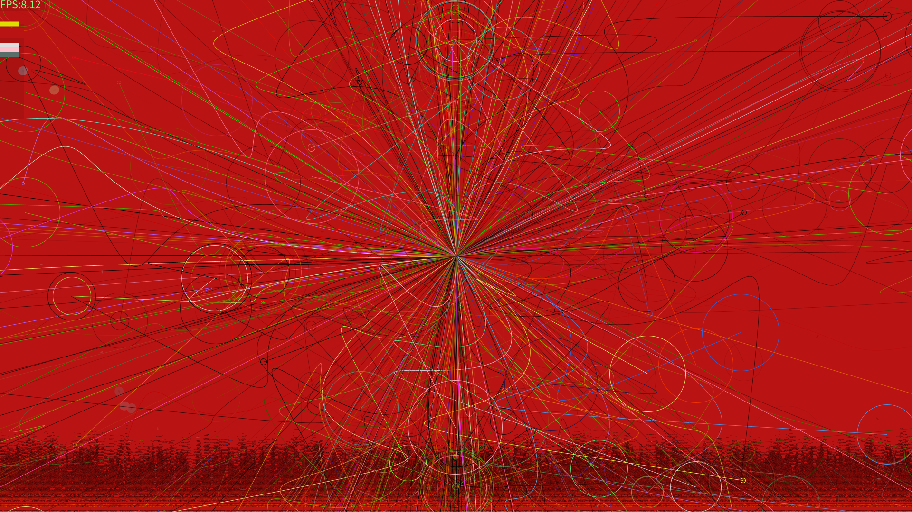</a>
<a href="screenshots/LCDD03805.png"></a>
<a href="screenshots/LCDD03808.png"></a>
<a href="screenshots/LCDD03842.png"></a>
<a href="screenshots/LCDD03932.png"></a>
<a href="screenshots/LCDD03970.png"></a>
<a href="screenshots/LCDD03973.png"></a>
<a href="screenshots/LCDD04010.png"></a>
<a href="screenshots/LCDD04017.png"></a>
<a href="screenshots/LCDD04019.png"></a>
<a href="screenshots/LCDD04021.png"></a>
<a href="screenshots/LCDD04099.png"></a>
<a href="screenshots/LCDD04108.png">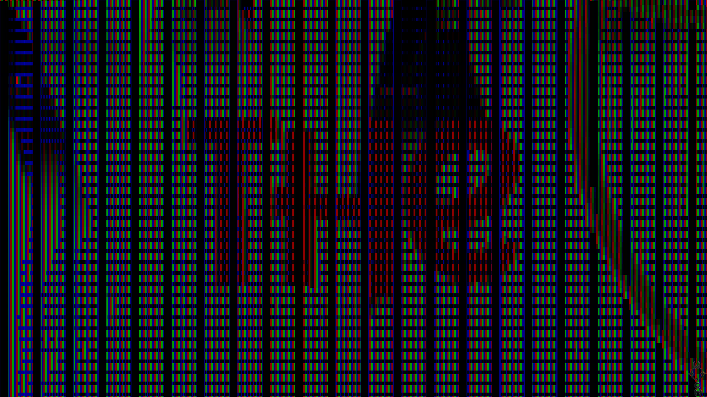</a>
<a href="screenshots/LCDD04150.png"></a>
<a href="screenshots/LCDD04214.png"></a>
<a href="screenshots/LCDD04235.png"></a>
<a href="screenshots/LCDD04246.png"></a>
<a href="screenshots/LCDD04259.png"></a>
<a href="screenshots/LCDD04331.png"></a>
<a href="screenshots/LCDD04379.png"></a>
<a href="screenshots/LCDD04394.png"></a>
<a href="screenshots/LCDD04511.png"></a>
<a href="screenshots/LCDD04512.png"></a>
<a href="screenshots/LCDD04514.png"></a>
<a href="screenshots/LCDD04526.png"></a>
<a href="screenshots/LCDD04606.png"></a>
<a href="screenshots/LCDD04711.png"></a>
<a href="screenshots/LCDD04714.png"></a>
<a href="screenshots/LCDD04731.png"></a>
<a href="screenshots/LCDD04779.png"></a>
<a href="screenshots/LCDD04826.png"></a>
<a href="screenshots/LCDD04959.png"></a>
<a href="screenshots/LCDD04982.png"></a>
<a href="screenshots/LCDD05000.png"></a>
<a href="screenshots/LCDD05101.png"></a>
<a href="screenshots/LCDD05103.png"></a>
<a href="screenshots/LCDD05173.png"></a>
<a href="screenshots/LCDD05424.png"></a>
<a href="screenshots/LCDD05456.png"></a>
<a href="screenshots/LCDD05457.png"></a>
<a href="screenshots/LCDD05464.png"></a>
<a href="screenshots/LCDD05476.png"></a>
<a href="screenshots/LCDD05564.png"></a>
<a href="screenshots/LCDD05673.png"></a>
<a href="screenshots/LCDD05692.png"></a>
<a href="screenshots/LCDD05859.png">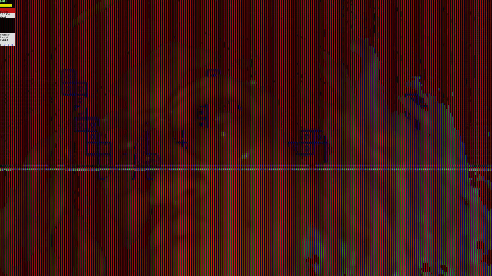</a>
<a href="screenshots/LCDD05881.png">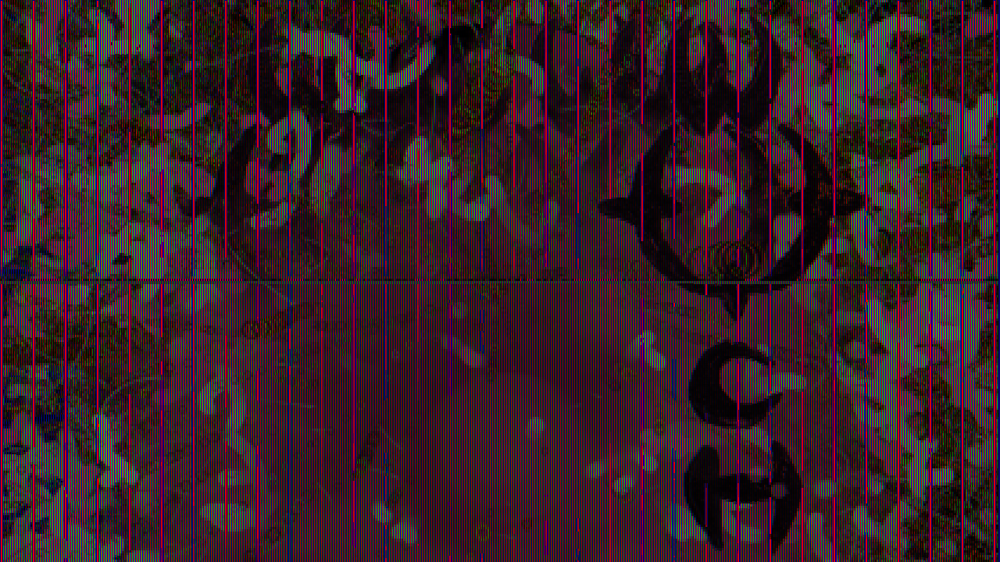</a>
<a href="screenshots/LCDD06056.png"></a>
<a href="screenshots/LCDD06060.png">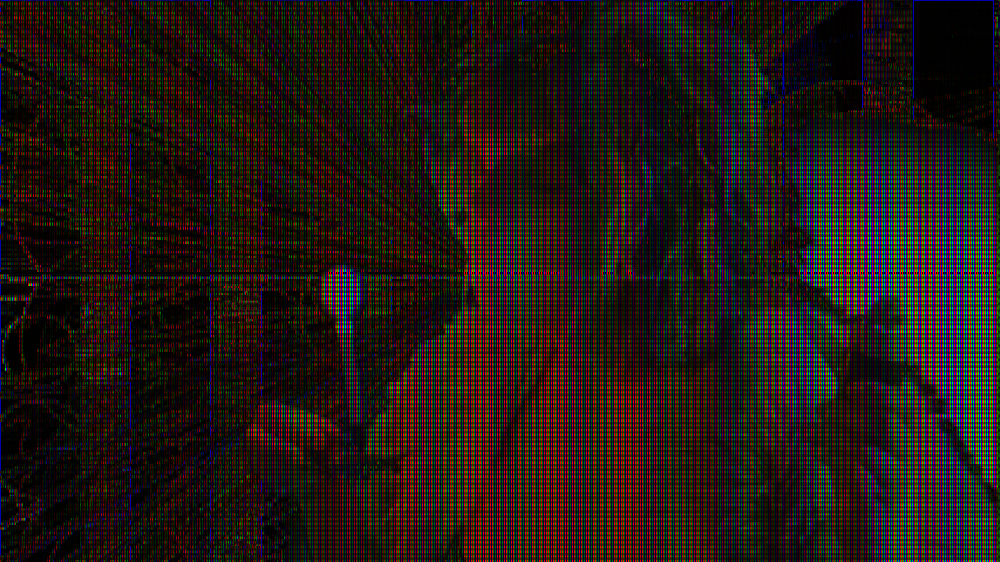</a>
<a href="screenshots/LCDD06090.png"></a>
<a href="screenshots/LCDD06113.png"></a>
<a href="screenshots/LCDD06120.png"></a>
<a href="screenshots/LCDD06286.png"></a>
<a href="screenshots/LCDD06417.png"></a>
<a href="screenshots/LCDD06585.png"></a>
<a href="screenshots/LCDD06799.png"></a>
<a href="screenshots/LCDD06841.png"></a>
<a href="screenshots/LCDD06843.png"></a>
<a href="screenshots/LCDD06900.png"></a>
<a href="screenshots/LCDD06923.png"></a>
<a href="screenshots/LCDD07165.png"></a>
<a href="screenshots/LCDD07210.png"></a>
<a href="screenshots/LCDD07243.png"></a>
<a href="screenshots/LCDD07345.png"></a>
<a href="screenshots/LCDD07347.png"></a>
<a href="screenshots/LCDD07420.png"></a>
<a href="screenshots/LCDD07444.png"></a>
<a href="screenshots/LCDD07486.png"></a>
<a href="screenshots/LCDD07580.png">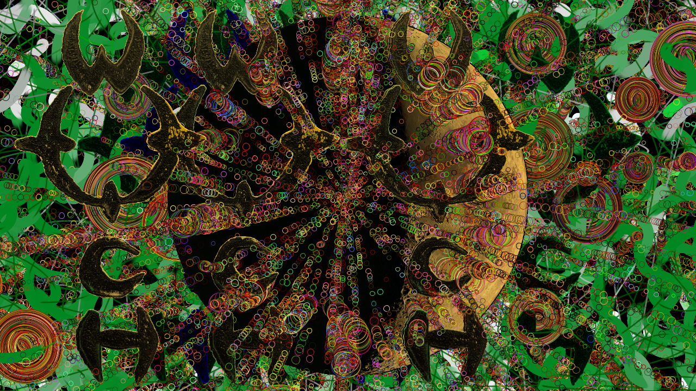</a>
<a href="screenshots/LCDD07581.png"></a>
<a href="screenshots/LCDD07631.png"></a>
<a href="screenshots/LCDD07794.png"></a>
<a href="screenshots/LCDD07904.png"></a>
<a href="screenshots/LCDD07950.png"></a>
<a href="screenshots/LCDD07988.png"></a>
<a href="screenshots/LCDD08015.png"></a>
<a href="screenshots/LCDD08055.png"></a>
<a href="screenshots/LCDD08118.png"></a>
<a href="screenshots/LCDD08210.png"></a>
<a href="screenshots/LCDD08256.png"></a>
<a href="screenshots/LCDD08258.png"></a>
<a href="screenshots/LCDD08518.png"></a>
<a href="screenshots/LCDD08530.png"></a>
<a href="screenshots/LCDD08577.png"></a>
<a href="screenshots/LCDD08596.png"></a>
<a href="screenshots/LCDD08672.png"></a>
<a href="screenshots/LCDD08690.png"></a>
<a href="screenshots/LCDD08771.png"></a>
<a href="screenshots/LCDD08787.png"></a>
<a href="screenshots/LCDD08796.png"></a>
<a href="screenshots/LCDD08801.png"></a>
<a href="screenshots/LCDD08812.png"></a>
<a href="screenshots/LCDD08836.png"></a>
<a href="screenshots/LCDD08914.png"></a>
<a href="screenshots/LCDD08934.png"></a>
<a href="screenshots/LCDD08974.png"></a>
<a href="screenshots/LCDD09000.png"></a>
<a href="screenshots/LCDD09066.png"></a>
<a href="screenshots/LCDD09121.png"></a>
<a href="screenshots/LCDD09149.png"></a>
<a href="screenshots/LCDD09170.png"></a>
<a href="screenshots/LCDD09200.png"></a>
<a href="screenshots/LCDD09396.png"></a>
<a href="screenshots/LCDD09428.png"></a>
<a href="screenshots/LCDD09443.png"></a>
<a href="screenshots/LCDD09463.png"></a>
<a href="screenshots/LCDD09585.png"></a>
<a href="screenshots/LCDD09857.png"></a>
<a href="screenshots/LCDD09963.png"></a>
<a href="screenshots/LCDD09966.png"></a>
<a href="screenshots/LCDD09994.png"></a>
<a href="screenshots/LCDD10026.png"></a>
<a href="screenshots/LCDD10385.png"></a>
<a href="screenshots/LCDD10390.png"></a>
<a href="screenshots/LCDD10416.png"></a>
<a href="screenshots/LCDD10436.png"></a>
<a href="screenshots/LCDD10459.png"></a>
<a href="screenshots/LCDD10461.png"></a>
<a href="screenshots/LCDD10468.png"></a>
<a href="screenshots/LCDD10474.png"></a>
<a href="screenshots/LCDD10537.png"></a>
<a href="screenshots/LCDD10555.png"></a>
<a href="screenshots/LCDD10575.png"></a>
<a href="screenshots/LCDD10790.png"></a>
<a href="screenshots/LCDD10912.png"></a>
<a href="screenshots/LCDD10958.png"></a>
<a href="screenshots/LCDD10985.png"></a>
<a href="screenshots/LCDD10987.png"></a>
<a href="screenshots/LCDD10989.png"></a>
<a href="screenshots/LCDD11058.png"></a>
<a href="screenshots/LCDD11323.png"></a>
<a href="screenshots/LCDD11356.png"></a>
<a href="screenshots/LCDD11436.png"></a>
<a href="screenshots/LCDD11466.png"></a>
<a href="screenshots/LCDD11515.png"></a>
<a href="screenshots/LCDD11675.png"></a>
<a href="screenshots/LCDD11750.png"></a>
<a href="screenshots/LCDD11902.png"></a>
<a href="screenshots/LCDD11979.png">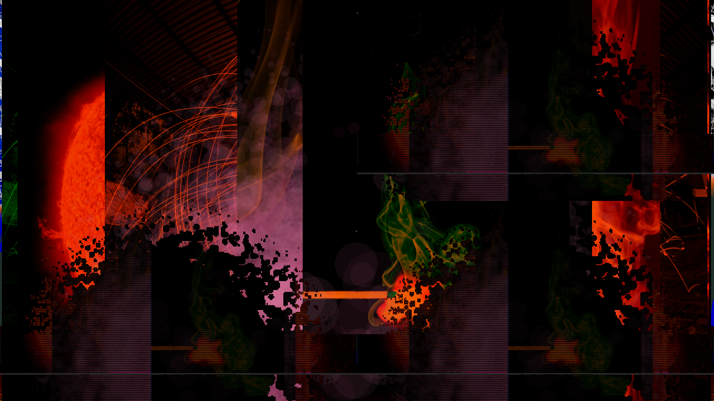</a>
<a href="screenshots/LCDD12440.png"></a>
<a href="screenshots/LCDD12490.png"></a>
<a href="screenshots/LCDD12506.png"></a>
<a href="screenshots/LCDD12529.png"></a>
<a href="screenshots/LCDD12559.png"></a>
<a href="screenshots/LCDD12587.png"></a>
<a href="screenshots/LCDD12591.png"></a>
<a href="screenshots/LCDD12669.png">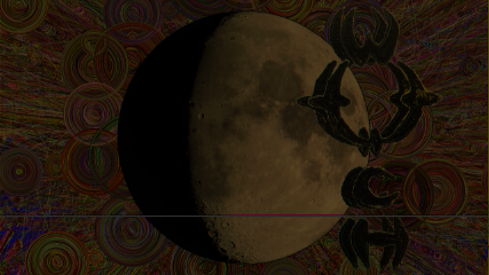</a>
<a href="screenshots/LCDD12715.png"></a>
<a href="screenshots/LCDD12750.png"></a>
<a href="screenshots/LCDD12930.png">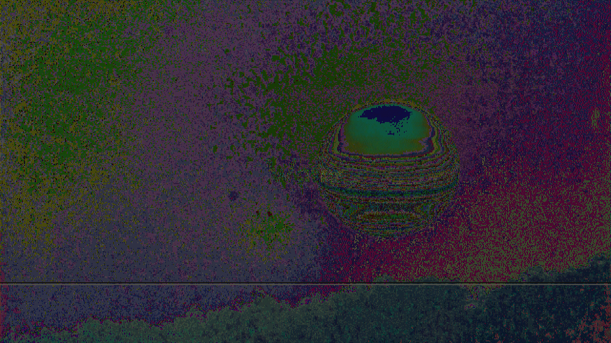</a>
<a href="screenshots/LCDD13169.png"></a>
<a href="screenshots/LCDD13259.png"></a>
<a href="screenshots/LCDD13290.png"></a>
<a href="screenshots/LCDD13338.png"></a>
<a href="screenshots/LCDD13350.png"></a>
<a href="screenshots/LCDD13560.png"></a>
<a href="screenshots/LCDD13948.png"></a>
<a href="screenshots/LCDD14500.png"></a>
<a href="screenshots/LCDD14614.png"></a>
<a href="screenshots/LCDD14639.png"></a>
<a href="screenshots/LCDD14915.png"></a>
<a href="screenshots/LCDD15126.png"></a>
<a href="screenshots/LCDD15640.png"></a>
<a href="screenshots/LCDD15704.png"></a>
<a href="screenshots/LCDD16079.png"></a>
<a href="screenshots/LCDD16177.png"></a>
<a href="screenshots/LCDD16234.png"></a>
<a href="screenshots/LCDD17139.png"></a>
<a href="screenshots/LCDD17230.png"></a>
<a href="screenshots/LCDD17319.png"></a>
<a href="screenshots/LCDD17426.png"></a>
<a href="screenshots/LCDD18593.png"></a>
<a href="screenshots/LCDD19494.png"></a>
<a href="screenshots/LCDD19938.png"></a>
<a href="screenshots/LCDD20213.png"></a>
<a href="screenshots/LCDD20311.png"></a>
<a href="screenshots/LCDD21400.png"></a>
<a href="screenshots/LCDD22890.png"></a>
<a href="screenshots/LCDD23541.png"></a>
<a href="screenshots/LCDD24242.png"></a>
<a href="screenshots/LCDD24824.png"></a>
<a href="screenshots/LCDD24904.png"></a>
<a href="screenshots/LCDD26164.png"></a>
<a href="screenshots/LCDD27095.png"></a>
<a href="screenshots/LCDD27729.png"></a>
<a href="screenshots/LCDD28279.png"></a>
<a href="screenshots/LCDD28928.png">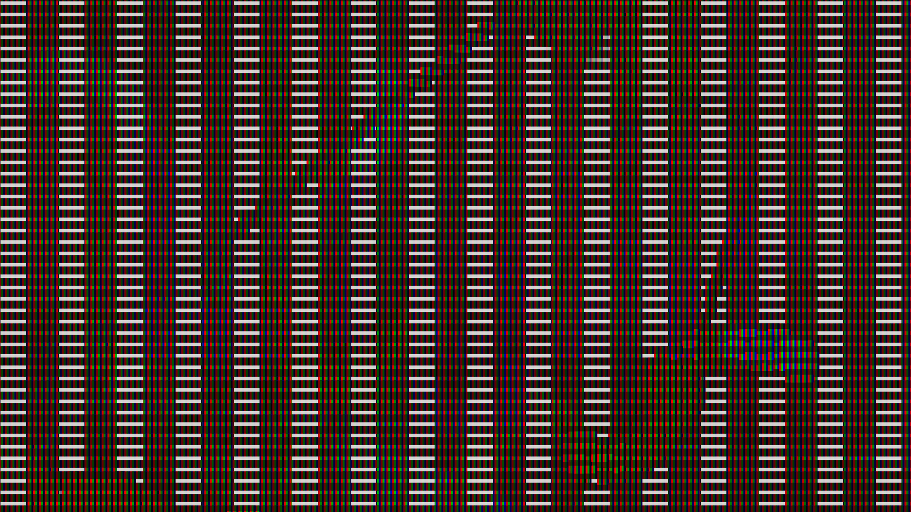</a>
<a href="screenshots/LCDD28949.png"></a>
<a href="screenshots/LCDD30899.png"></a>
<a href="screenshots/LCDD37587.png"></a>
<a href="screenshots/LCDD39297.png"></a>
<a href="screenshots/LCDD41565.png"></a>
<a href="screenshots/LCDD45692.png"></a>
<a href="screenshots/LCDD45757.png"></a>
<a href="screenshots/LCDD45892.png"></a>
<a href="screenshots/LCDD47104.png"></a>
<a href="screenshots/LCDD48181.png"></a>
<a href="screenshots/LCDD49162.png"></a>
<a href="screenshots/LCDD49199.png"></a>
<a href="screenshots/LCDD53456.png"></a>
<a href="screenshots/LCDD57754.png"></a>
<a href="screenshots/LCDD57844.png"></a>
<a href="screenshots/LCDD57871.png"></a>
<a href="screenshots/LCDD58342.png"></a>